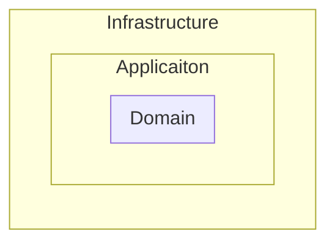

# Astro Starter Kit: Basics

```sh
npm create astro@latest -- --template basics
```

[](https://stackblitz.com/github/withastro/astro/tree/latest/examples/basics)
[](https://codesandbox.io/p/sandbox/github/withastro/astro/tree/latest/examples/basics)
[](https://codespaces.new/withastro/astro?devcontainer_path=.devcontainer/basics/devcontainer.json)

> 🧑‍🚀 **Seasoned astronaut?** Delete this file. Have fun!


## 🚀 Project Structure

Inside of your Astro project, you'll see the following folders and files:

```text
/
├── public/
│   └── favicon.svg
├── src/
│   ├── layouts/
│   │   └── Layout.astro
│   └── pages/
│       └── index.astro
└── package.json
```

To learn more about the folder structure of an Astro project, refer to [our guide on project structure](https://docs.astro.build/en/basics/project-structure/).

## 🧞 Commands

All commands are run from the root of the project, from a terminal:

| Command                   | Action                                           |
| :------------------------ | :----------------------------------------------- |
| `npm install`             | Installs dependencies                            |
| `npm run dev`             | Starts local dev server at `localhost:4321`      |
| `npm run build`           | Build your production site to `./dist/`          |
| `npm run preview`         | Preview your build locally, before deploying     |
| `npm run astro ...`       | Run CLI commands like `astro add`, `astro check` |
| `npm run astro -- --help` | Get help using the Astro CLI                     |

## 👀 Want to learn more?

Feel free to check [our documentation](https://docs.astro.build) or jump into our [Discord server](https://astro.build/chat).

## Authentication

Amazon Cognito is used to authenticate the `User`

## DDD
Read this [primer](https://medium.com/spotlight-on-javascript/domain-driven-design-for-javascript-developers-9fc3f681931a) on Domain Driven Development



The inner layers can use anything declared in the outer layer. 
Source code dependencies only point inwards.

> The inner layer is your business logic, the application layer orchestrates this business logic in response to clients requests and the infrastructure layer contains concrete implementations of the code dealing with the database, web-services, etc.
> 
### Domain

Online storage and retrieval of Todos tied to a specific User. The User must be logged to see their Todos

### Domain Objects

- Entities (mutable objects with identifiers)
  - Todo
    - content
    - createdAt
    - completed
  - User
- Value Objects (immutable values as properties, have methods)
  - Todo
    - email
- Aggregates
  - List
    - Todos[]
    - User


